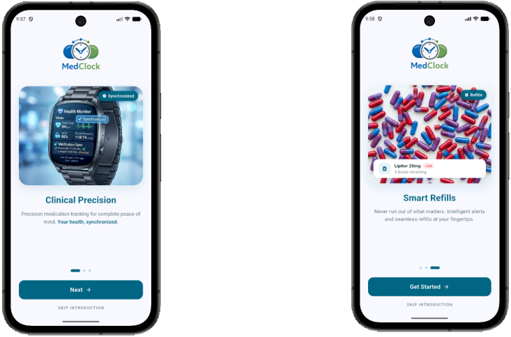

# MedClock

> **MedClock** is a smart medication reminder and management mobile application designed to help users track daily prescriptions, improve medicine adherence, and manage inventory refills effortlessly.

---

## Screenshots

<p align="center">
  
</p>

*Clinical Precision & Smart Refill Management*

---

## Description

**MedClock** provides an intuitive, reliable solution for managing complex medication schedules. Users receive timely notifications for scheduled doses, track monthly adherence rates, log taken or missed doses, and keep tabs on stock levels with automatic refill warnings. 

### Key Features
- **Daily Medication Scheduling & History**: Track daily doses with interactive calendars and quick confirm/skip options.
- **Live Adherence Analytics**: Instant feedback on monthly adherence percentages, on-time doses, and missed logs.
- **Low Stock & Refill Alerts**: Colour-coded stock labels (e.g., Low Stock warnings) with immediate pill count estimation.
- **Local Reminders & Notifications**: Receive scheduled push notifications so you never miss a dose.
- **Offline-First Experience**: Local persistence with Hive to ensure seamless offline usage with remote sync capabilities.

---

## Tech Stack

### Frontend (Mobile)
- **Framework**: [Flutter](https://flutter.dev/) (Dart)
- **State Management**: [Riverpod](https://riverpod.dev/) (`flutter_riverpod`, `riverpod_annotation`)
- **Local Storage**: [Hive](https://pub.dev/packages/hive) & [Flutter Secure Storage](https://pub.dev/packages/flutter_secure_storage)
- **Networking**: [Dio](https://pub.dev/packages/dio)
- **UI Components & Charts**: [FL Chart](https://pub.dev/packages/fl_chart), `flutter_svg`
- **Notifications**: `flutter_local_notifications` & `timezone`
- **Device Capabilities**: `image_picker`, `mobile_scanner`, `google_maps_flutter`

### Backend & Database
- **Runtime**: [Node.js](https://nodejs.org/)
- **Framework**: [Express.js](https://expressjs.com/)
- **Database**: [MongoDB](https://www.mongodb.com/) (Mongoose)
- **Authentication**: JWT (JSON Web Tokens) & `bcrypt`

---

## Getting Started

### Prerequisites
- [Flutter SDK](https://docs.flutter.dev/get-started/install) (v3.11.0 or higher)
- [Node.js](https://nodejs.org/) (v16+ recommended)
- MongoDB instance (Local or Atlas)

### Flutter App Setup
```bash
# Clone the repository
git clone https://github.com/sudipchaudhary30/medclock.git
cd medclock

# Get dependencies
flutter pub get

# Run the application
flutter run
```

### Backend Setup
```bash
cd backend
npm install
npm start
```
